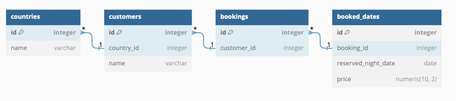

# Pace Engineering Test

Thank you for taking the time to interview with Pace! 

The next step will be Live Coding interview with our engineering team. During the call we will be implementing some changes to the example code in this repo.
To help you in preparing for the interview, we are sending the codebase to you today, allowing you to familiarize yourself with how it works.

Please familiarise yourself with code in ex1_customers.py and ex2_rateplans.py as well as the following database schema.

## Requirements

Before the interview, we would ask you to prepare your development setup. What you'll need is:
* your IDE of choice,
* python 3.7 or later
* this repo 

Make sure before the interview that `python src/ex1_customers.py` and `python src/ex2_rateplans.py` commands are working.

Good Luck!
